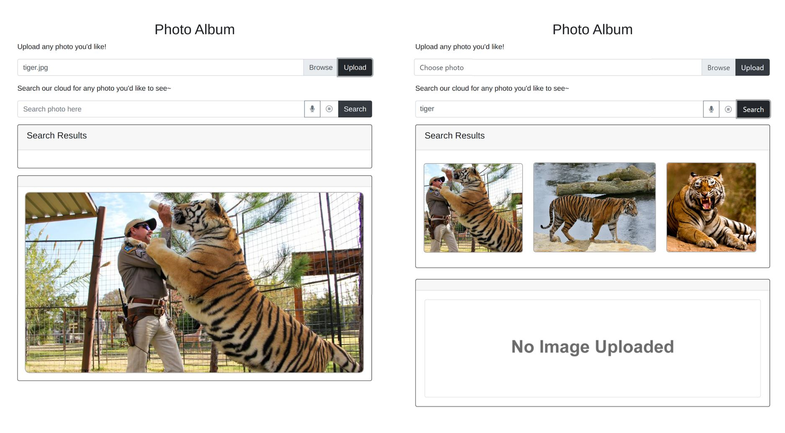
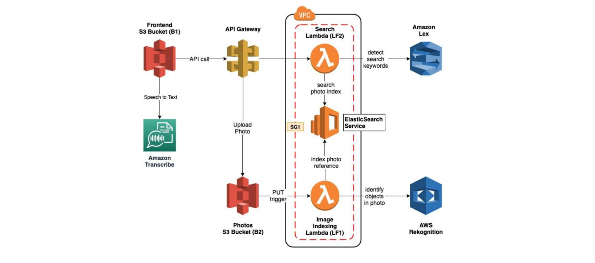

# AWS Smart AI Photo Album

Contributors: Jerry Zhang, Wenhao Li

The following project implements a photo album web application, that can be searched using natural language through both text and voice. It utilizes various AWS microservices such as Lex, ElasticSearch, and Rekognition to create an intelligent search layer to query your photos for people, objects, actions, landmarks and more.

The following image showcases the AWS architecture 

